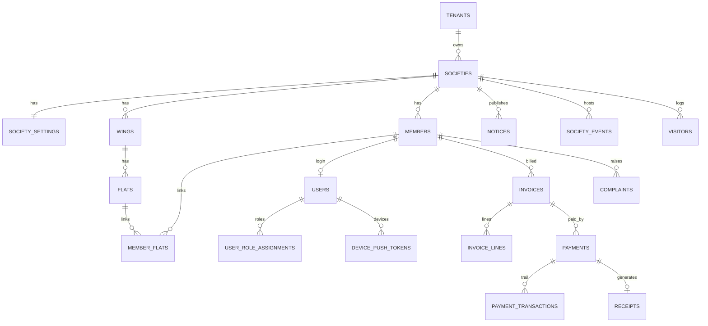

# SocietyOne — Database Design & SQL Reference

**Purpose:** Single reference for the full PostgreSQL design, tables, relationships, and every SQL migration / function / view / policy in this repo.  
**Source of truth:** `api/prisma/schema.prisma` + SQL under `api/supabase/migrations/` and `api/prisma/migrations/`.  
**Stack:** Supabase Postgres · Prisma · NestJS API  

**MyGate-style pillars (gate, amenities, polls, ledger):** see [`MYGATE_SYSTEM_DESIGN.md`](./MYGATE_SYSTEM_DESIGN.md) and migration `api/supabase/migrations/20260727160000_mygate_pillars.sql`.

For deeper ops topics (indexing strategy, Redis, backup/DR), see also `api/docs/database-architecture/`.

---

## 1. Big picture

SocietyOne is a **multi-tenant society-management** database:

```text
Tenant (management company / SaaS customer)
  └── Society (one building / CHS)
        ├── Wings → Flats
        ├── Members ↔ Flats (member_flats)
        ├── Users + roles (login accounts)
        ├── Billing: Charge catalog → Invoices → Payments → Receipts
        ├── Ops: Notices, Events, Visitors, Complaints, Expenses, Documents
        └── Observability: Audit / Activity / Notifications + report tables
```

### Design rules

| Rule | How it shows up |
| --- | --- |
| Dual tenancy | Almost every business row has `tenant_id` + `society_id` |
| Soft delete | `deleted_at` / `deleted_by_id` on mutable entities |
| Optimistic concurrency | `row_version` bumped on update (SQL trigger helper) |
| Money safety | No `ON DELETE CASCADE` from invoices / payments / receipts; append-only `payment_transactions` |
| Status codes | Lookup tables (`lk_*`) instead of rigid Postgres ENUMs |
| UUID PKs | `uuid` + `gen_random_uuid()` (`pgcrypto`) |
| Case-insensitive email | `citext` on `users.email` / `members.email` |

---

## 2. Entity-relationship overview



---

## 3. Table catalog (by domain)

### 3.1 Lookup tables (`lk_*`)

Seeded code tables (prefer these over PG enums so new codes can be added without migrations).

| Table | Purpose | Example codes |
| --- | --- | --- |
| `lk_role` | Auth roles | `SUPER_ADMIN`, `SOCIETY_ADMIN`, `COMMITTEE_MEMBER`, `SECURITY_GUARD`, `RESIDENT` |
| `lk_society_status` | Society lifecycle | `ACTIVE`, `INACTIVE`, `SUSPENDED` |
| `lk_invoice_status` | Invoice state | `PENDING`, `PARTIAL`, `PAID`, `OVERDUE`, `CANCELLED` |
| `lk_payment_status` | Payment state | `CREATED`, `PENDING`, `AUTHORIZED`, `CAPTURED`, `FAILED`, `REFUNDED` |
| `lk_payment_mode` | How money was paid | `UPI`, `CASH`, `RAZORPAY`, `CHEQUE`, … |
| `lk_visitor_status` | Gate log | `LOGGED`, `EXPECTED`, `APPROVED`, `CHECKED_OUT`, … |
| `lk_complaint_status` / `lk_complaint_priority` | Tickets | `OPEN`… / `LOW`…`CRITICAL` |
| `lk_notification_channel` / `lk_notification_status` | Outbound messages | `EMAIL`/`PUSH`… · `QUEUED`/`SENT`… |
| `lk_document_type` | Storage docs | `INVOICE_PDF`, `RECEIPT_PDF`, … |
| `lk_event_status` | Community events | `UPCOMING`, … |

Defined + seeded in: `api/supabase/migrations/enterprise/02_lookup_tables.sql`.

### 3.2 Tenancy & identity

| Table | Role |
| --- | --- |
| `tenants` | Top-level SaaS customer |
| `societies` | One society/building under a tenant (`UNIQUE(tenant_id, slug)`) |
| `users` | Login accounts (`email` citext unique); optional link to `member_id` |
| `user_role_assignments` | Many roles per user, scoped by society (`UNIQUE(user_id, role_code, society_id)`) |
| `refresh_tokens` | Hashed refresh JWTs + expiry / revoke |
| `password_reset_tokens` | Hashed reset tokens + expiry / used_at |
| `device_push_tokens` | Expo push tokens per user (`UNIQUE(user_id, expo_token)`) |

### 3.3 Property

| Table | Role |
| --- | --- |
| `wings` | Building wing/block (`UNIQUE(society_id, code)`) |
| `flats` | Unit under a wing; optional `bhk_type`, per-flat `maintenance_amount` |
| `members` | Residents / owners (email, phone, active flag) |
| `member_flats` | M:N member↔flat with `relation` (`OWNER`/`TENANT`/`FAMILY`), `is_primary`, validity dates |

### 3.4 Billing

| Table | Role |
| --- | --- |
| `society_settings` | 1:1 with society — prefixes, due day, default charges, BHK rates, bank/UPI, Razorpay key |
| `charge_catalog` | Named charge lines per society |
| `number_sequences` | Atomic per-society yearly counters for `INVOICE` / `RECEIPT` |
| `invoices` | Monthly bill per member (`UNIQUE(society_id, invoice_no)`, `UNIQUE(society_id, member_id, billing_month)`) |
| `invoice_lines` | Line items (`is_deduction` allowed) |
| `payments` | Payment attempt (Razorpay ids, idempotency key, mode/status codes) |
| `payment_transactions` | **Append-only** money trail events |
| `payment_webhooks` | Raw provider events (`UNIQUE(provider, event_id)`) |
| `receipts` | Official receipt (1:1 with payment) |

**Invoice money fields:** `maintenance_subtotal`, `arrears_subtotal`, `late_fee`, `previous_outstanding`, `advance`, `total_amount`, `paid_amount`, `outstanding`.

### 3.5 Operations

| Table | Role |
| --- | --- |
| `notices` | Society notices (pin + publish time) |
| `society_events` | Events, budget, RSVP count, status |
| `visitors` | Gate entries (`flat_label`, purpose, vehicle, status) |
| `complaints` | Resident tickets |
| `documents` | Metadata for Supabase Storage files |
| `expenses` | Society expense ledger (often used by admin finance UI) |

### 3.6 Observability & reporting

| Table | Role |
| --- | --- |
| `audit_logs` | Who changed what (append-oriented) |
| `activity_logs` | High-level activity feed |
| `notifications` | Outbound queue (email / WhatsApp / push / SMS) |
| `rpt_society_daily` | Job-maintained daily aggregates |
| `rpt_society_monthly` | Job-maintained monthly collection % |

---

## 4. Core business flows (how rows connect)

### 4.1 Onboarding

1. Insert `tenants` → `societies` → `society_settings`.
2. Create `wings` / `flats`.
3. Create `members` + `member_flats` (mark primary flat).
4. Create `users` linked to `member_id` (residents) or society admin; assign `user_role_assignments`.

### 4.2 Monthly billing

1. Read `society_settings` (and optionally flat `maintenance_amount` / BHK defaults in app logic).
2. Allocate invoice number via `app.generate_invoice_number(...)` / `number_sequences`.
3. Insert `invoices` + `invoice_lines`.
4. Carry prior dues via `previous_outstanding` / `app.member_outstanding(member_id)`.

SQL helper: `app.generate_monthly_bills(tenant_id, society_id, 'YYYY-MM')`  
(File: `enterprise/10_functions_triggers.sql`)

### 4.3 Collection / payment

1. Insert `payments` (`CREATED` → … → `CAPTURED` / `FAILED`).
2. On `CAPTURED`, trigger `app.on_payment_status_update`:
   - append `payment_transactions`
   - create `receipts` if missing
   - bump `invoices.paid_amount` (status/outstanding recalculated by invoice triggers)
   - queue a `notifications` row

### 4.4 Auth tokens

- Login stores hashed refresh row in `refresh_tokens`.
- Forgot-password stores hashed row in `password_reset_tokens`.
- Mobile push registers `device_push_tokens`.

---

## 5. SQL inventory (what was written where)

### 5.1 Prisma migrations

| Path | What it does |
| --- | --- |
| `api/prisma/migrations/20240101000000_baseline/migration.sql` | **Baseline marker only** — production DB already has schema; do **not** re-run DDL. Resolve with `prisma migrate resolve --applied`. |
| `api/prisma/migrations/20260722130000_device_push_tokens/migration.sql` | Creates `device_push_tokens` + unique/index + FK to `users`. |

### 5.2 Supabase incremental migrations

| File | What the SQL does |
| --- | --- |
| `20260720000000_rls_policies.sql` | Early RLS policies (superseded/extended by enterprise `11_rls_policies.sql`) |
| `20260720120000_remove_member_tenant_name.sql` | Drops obsolete `members.tenant_name`; recreates `v_resident_details` |
| `20260720160000_password_reset_tokens.sql` | Creates `password_reset_tokens` + indexes + FK |
| `20260720180000_flat_bhk_maintenance.sql` | Adds `flats.bhk_type`, `flats.maintenance_amount`, and BHK defaults on `society_settings` |
| `20260720220000_production_hardening.sql` | Partial indexes + CHECK constraints + `ANALYZE` on hot tables |
| `20260727160000_mygate_pillars.sql` | MyGate pillars: passes, gate_events, staff, panic, amenities, polls, ledger, tax + `app.validate_visitor_pass` |

### 5.3 Enterprise SQL pack (`api/supabase/migrations/enterprise/`)

Apply in numeric order (see also `api/docs/database-architecture/07-MIGRATION-ORDER.md`).

| # | File | Contents |
| --- | --- | --- |
| 01 | `01_extensions_types.sql` | Extensions + `app` schema + session/RLS helpers + `set_updated_at` trigger fn |
| 02 | `02_lookup_tables.sql` | All `lk_*` tables + seed `INSERT`s |
| 06 | `06_partitioned_ledgers.sql` | `app.ensure_month_partitions(...)` helper for monthly RANGE partitions |
| 09 | `09_views_matviews.sql` | Reporting views + materialized views + refresh function |
| 10 | `10_functions_triggers.sql` | Billing numbers, invoice recalc, monthly bills, audit, payment→receipt |
| 11 | `11_rls_policies.sql` | `ENABLE ROW LEVEL SECURITY` + role policies |
| 12 | `12_indexes.sql` | Hot-path partial / covering indexes (`CONCURRENTLY`) |

> Note: Base `CREATE TABLE` for the main entities is owned by the live Prisma/enterprise schema (already present on production Supabase). Enterprise SQL focuses on lookups, functions, views, RLS, indexes, and partitions.

---

## 6. Functions & triggers (SQL logic)

All live under schema **`app`**.

### 6.1 Session / RLS context (`01_extensions_types.sql`)

| Function | Returns | Meaning |
| --- | --- | --- |
| `app.current_tenant_id()` | `uuid` | From `current_setting('app.tenant_id')` |
| `app.current_society_id()` | `uuid` | From `app.society_id` |
| `app.current_user_id()` | `uuid` | From `app.user_id` |
| `app.current_member_id()` | `uuid` | From `app.member_id` |
| `app.current_role()` | `text` | From `app.role` |
| `app.is_super_admin()` | `boolean` | Role = `SUPER_ADMIN` |
| `app.set_updated_at()` | trigger | Sets `updated_at = now()`, increments `row_version` |

Nest (or a DB wrapper) should `SET LOCAL app.tenant_id / society_id / user_id / member_id / role` per request/transaction for RLS to work.

### 6.2 Billing helpers (`10_functions_triggers.sql`)

| Function | Purpose |
| --- | --- |
| `app.next_document_number(tenant, society, seq_type, year, prefix)` | Atomic upsert on `number_sequences`; returns `PREFIX-YYYY-####` |
| `app.generate_invoice_number(...)` | Uses `society_settings.invoice_prefix` |
| `app.generate_receipt_number(...)` | Uses `society_settings.receipt_prefix` |
| `app.recalc_invoice_totals()` | Trigger: sum lines → update totals; or on invoice update recompute `outstanding` + status (`PENDING`/`PARTIAL`/`PAID`/`OVERDUE`) |
| `app.calculate_penalty(society, due_date, outstanding)` | Returns late fee from settings if overdue |
| `app.member_outstanding(member_id)` | `SUM(outstanding)` for open (non-cancelled/non-paid) invoices |
| `app.generate_monthly_bills(tenant, society, 'YYYY-MM')` | Set-based monthly invoice creation for active members |
| `app.write_audit()` | `SECURITY DEFINER` trigger writer into `audit_logs` |
| `app.on_payment_status_update()` | On payment → `CAPTURED`: transaction row, receipt, invoice paid bump, notification |

### 6.3 Partitions (`06_partitioned_ledgers.sql`)

| Function | Purpose |
| --- | --- |
| `app.ensure_month_partitions(parent, year, ts_column)` | Creates 12 monthly child partitions for a RANGE-partitioned parent |

Suggested parents (when converted): `payments`, `payment_transactions`, `payment_webhooks`, `audit_logs`, `activity_logs`, `notifications`.

### 6.4 Reporting refresh (`09_views_matviews.sql`)

| Function | Purpose |
| --- | --- |
| `app.refresh_reporting_matviews()` | `REFRESH MATERIALIZED VIEW CONCURRENTLY` for all dashboard matviews |

---

## 7. Views & materialized views

### Regular views

| View | Joins / meaning |
| --- | --- |
| `v_invoice_details` | Invoice + member + society + flat/wing |
| `v_resident_details` | Member + primary flat/wing + `app.member_outstanding` |
| `v_payment_details` | Payment + invoice + member + receipt |

### Materialized views

| Matview | Aggregate |
| --- | --- |
| `mv_dashboard_summary` | Per society: outstanding, pending invoices, payments today, visitors today |
| `mv_monthly_collection` | Per society + billing month: billed / collected / outstanding / collection % |
| `mv_outstanding_report` | Open invoices with days overdue |
| `mv_resident_summary` | Per member: invoice count, outstanding, lifetime paid, last payment |
| `mv_payment_summary` | Per society/day/status/mode payment counts & sums |

Unique indexes exist so `REFRESH ... CONCURRENTLY` is safe.

---

## 8. Row Level Security (RLS)

Enabled on society-scoped tables (see `enterprise/11_rls_policies.sql`), including:

`societies`, `members`, `flats`, `invoices`, `invoice_lines`, `payments`, `payment_transactions`, `receipts`, `notices`, `society_events`, `visitors`, `complaints`, `documents`, `expenses`, `audit_logs`, `activity_logs`, `notifications`, `society_settings`.

### Policy model (summary)

| Actor | Access pattern |
| --- | --- |
| `SUPER_ADMIN` | Full access (`app.is_super_admin()`) |
| `SOCIETY_ADMIN` / `COMMITTEE_MEMBER` | Rows where `society_id` + `tenant_id` match session |
| `RESIDENT` | Own invoices / payments / receipts / complaints (`member_id`); society notices/events; own visitor insert/select |
| `SECURITY_GUARD` | Visitor read/write in current society |

> Production Nest currently often connects with a privileged DB role. RLS is defense-in-depth when session vars are set, or if Supabase Data API is ever exposed.

---

## 9. Indexes & constraints (SQL)

### Production hardening (`20260720220000_production_hardening.sql`)

**Indexes**

- `ix_member_flats_primary` — `(member_id, society_id)` where primary & not deleted  
- `ix_flats_society_wing` — `(society_id, wing_id)` active flats  
- `ix_users_email_active` — `(email)` where not deleted  

**CHECK constraints**

- `society_settings.due_day` between 1 and 28  
- invoice amounts ≥ 0 and `paid_amount ≤ total_amount + 0.01`  
- `payments.amount > 0`  
- `invoice_lines.amount ≥ 0`  
- receipt amounts ≥ 0  

### Hot-path indexes (`enterprise/12_indexes.sql`)

Partial / covering indexes on members, invoices (status, month, open), payments (created/status/idempotency), receipts, visitors, audit, notifications.

### Prisma / schema indexes

See `@@index` / `@@unique` in `api/prisma/schema.prisma` (society+status, billing month, Razorpay ids, etc.).

---

## 10. Extensions

From `01_extensions_types.sql` / Prisma datasource:

| Extension | Use |
| --- | --- |
| `pgcrypto` | `gen_random_uuid()` |
| `citext` | Case-insensitive emails |
| `pg_trgm` | Trigram search (optional fuzzy lookups) |

---

## 11. Example SQL operators use day-to-day

These are illustrative — Nest/Prisma usually wraps them.

```sql
-- Session context (required for RLS policies)
SELECT set_config('app.tenant_id',  '<tenant-uuid>', true);
SELECT set_config('app.society_id', '<society-uuid>', true);
SELECT set_config('app.user_id',    '<user-uuid>', true);
SELECT set_config('app.member_id',  '<member-uuid>', true);
SELECT set_config('app.role',       'SOCIETY_ADMIN', true);

-- Generate next invoice number
SELECT app.generate_invoice_number(
  '<tenant-uuid>'::uuid,
  '<society-uuid>'::uuid,
  2026
);

-- Member open dues
SELECT app.member_outstanding('<member-uuid>'::uuid);

-- Run monthly billing for a society
SELECT app.generate_monthly_bills(
  '<tenant-uuid>'::uuid,
  '<society-uuid>'::uuid,
  '2026-07'
);

-- Refresh dashboards
SELECT app.refresh_reporting_matviews();

-- Outstanding report
SELECT * FROM mv_outstanding_report
WHERE society_id = '<society-uuid>'::uuid
ORDER BY days_overdue DESC;
```

---

## 12. File map (quick links)

```text
api/prisma/schema.prisma                          ← Full logical schema (ORM)
api/prisma/migrations/                            ← Prisma migrate history
api/supabase/migrations/*.sql                     ← Incremental production SQL
api/supabase/migrations/enterprise/*.sql          ← Enterprise pack (fns/views/RLS/indexes)
api/docs/database-architecture/                   ← Deeper architecture docs
```

---

## 13. Status notes (keep honest)

- **Production schema** already exists on Supabase; baseline Prisma migration is a marker, not a recreate script.
- **Enterprise pack** may be partially applied depending on environment — verify with `\df app.*`, `\dv`, and `pg_policies` before re-running.
- **Partition conversion** (`06_partitioned_ledgers.sql`) is a helper + commented runbook; parents must be converted carefully in a maintenance window.
- **App expenses** in admin may also use local/cache patterns; DB `expenses` table is the intended long-term store.
- **Razorpay** fields live on `payments` / `payment_webhooks`; online pay can be disabled via API env without changing schema.

---

*Generated from the SocietyOne repo schema and SQL migrations. Update this file when you add tables, functions, or migrations.*
