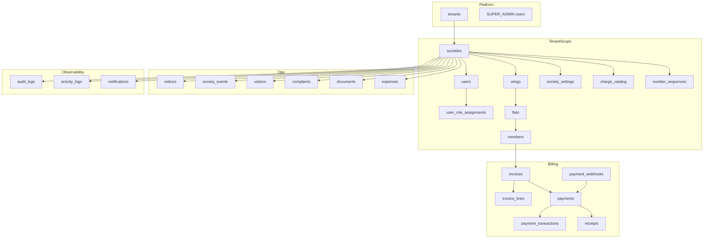
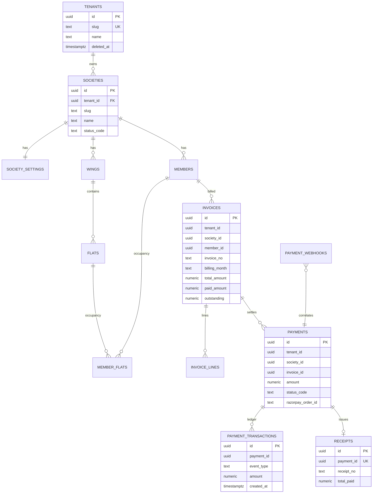
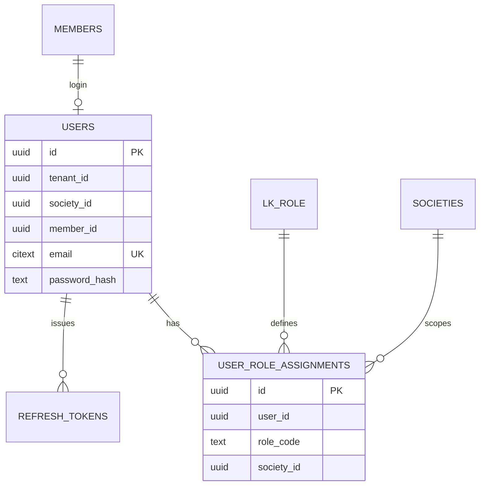

# ER Diagram — SocietyOne Enterprise

## Domain map

## Core financial ER

## Identity & RBAC ER

## Cardinality notes

| Relationship | Cardinality | Notes |
| --- | --- | --- |
| Tenant → Society | 1:N | Soft-delete society; never orphan finances |
| Member → Invoice | 1:N | Unique (society_id, member_id, billing_month) active |
| Invoice → Payment | 1:N | Partial payments allowed |
| Payment → Receipt | 1:0..1 | Only after CAPTURED |
| Payment → Transactions | 1:N | Append-only state machine trail |
| User → Roles | 1:N | Multi-role (committee + resident) |
